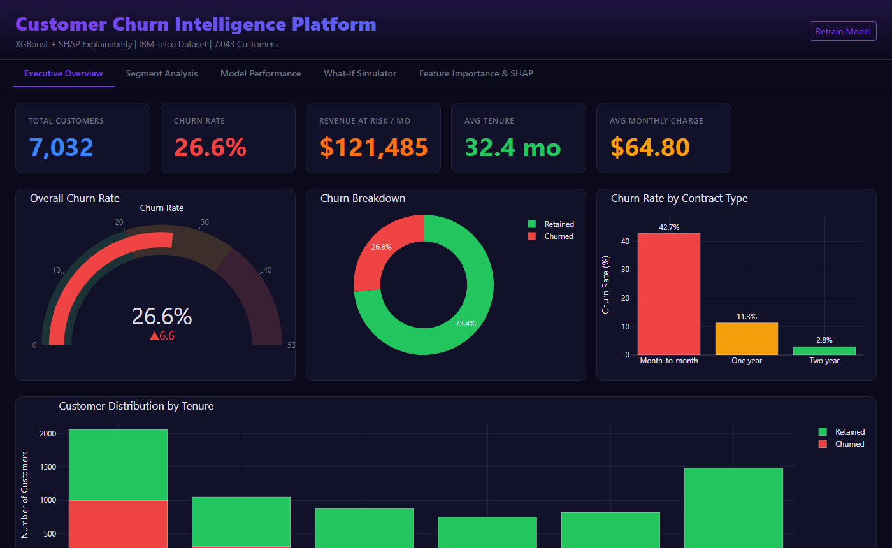
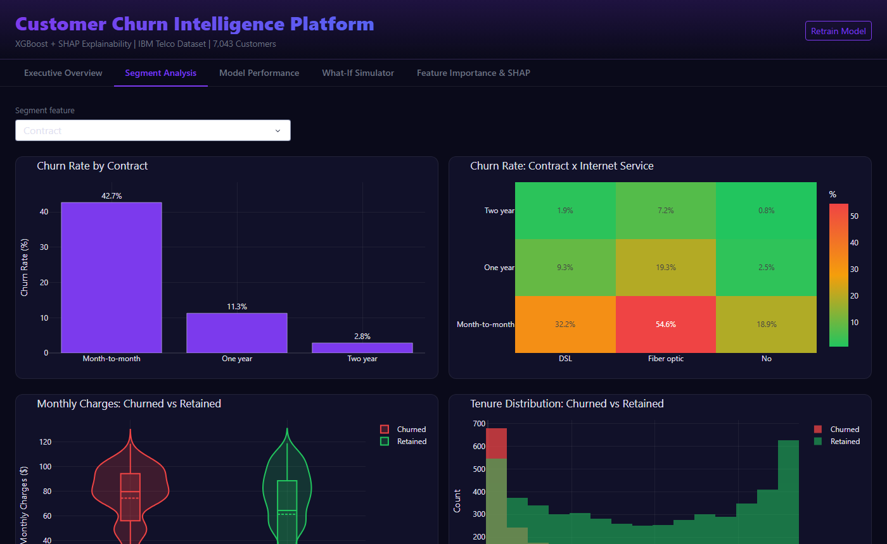
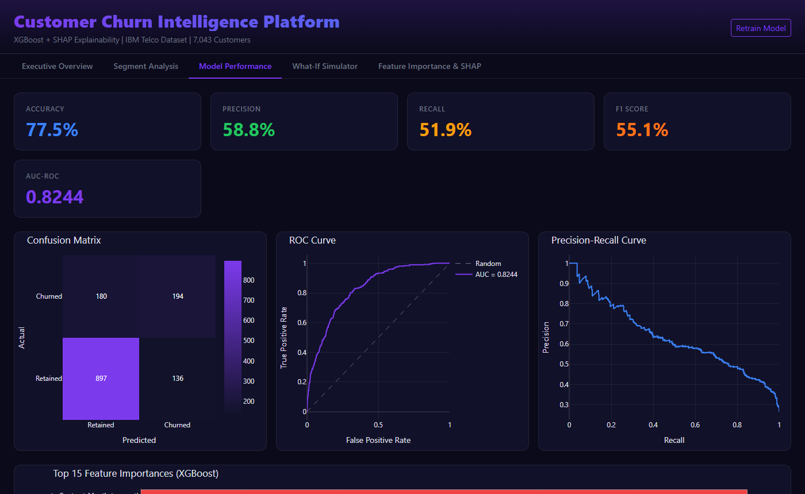
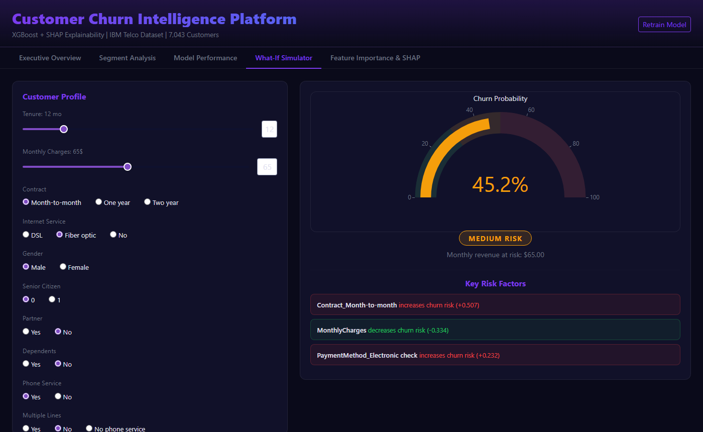
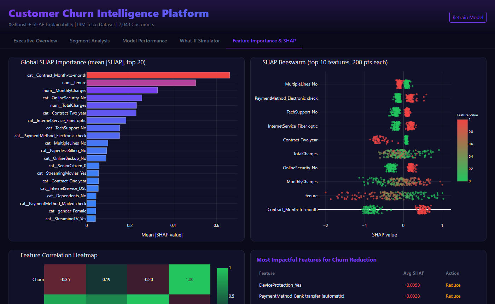

# Customer Churn Intelligence Platform

**Live Demo:** https://customer-churn-insights.onrender.com

> End-to-end machine learning dashboard for customer churn prediction, XGBoost model with SHAP explainability, interactive What-If simulator, full model diagnostics, and segment analysis. Built on the IBM Telco dataset (7,043 customers).


---

## Screenshots

| Executive Overview | Segment Analysis |
|:-----------------:|:----------------:|
|  |  |

| Model Performance | What-If Simulator |
|:-----------------:|:-----------------:|
|  |  |

| Feature Importance & SHAP | |
|:-------------------------:|-|
|  | |

---

## Features

### 📈 Executive Overview
Five KPI cards, Total Customers, Churn Rate, Monthly Revenue at Risk, Avg Tenure, Avg Monthly Charge, with a live churn rate gauge, churned vs retained donut, churn rate by contract type bar chart, and customer distribution by tenure segment (0–12 months through 60+).

### 🔍 Segment Analysis
Dropdown-driven segment explorer: select any categorical feature (Contract, Payment Method, Internet Service, etc.) and instantly see churn rate % per segment. Also includes a Contract × Internet Service churn heatmap, monthly charges violin distribution split by churn status, and tenure histogram by churn outcome.

### 🎯 Model Performance
Full ML diagnostics in one view: Accuracy (77.5%), Precision, Recall, F1, AUC-ROC (0.824) metric cards; annotated confusion matrix heatmap; ROC curve with AUC annotation; Precision-Recall curve; and top-15 XGBoost feature importances bar chart.

### âš¡ What-If Simulator
Interactive customer profile builder, adjust tenure, monthly charges, contract type, internet service, and 10+ other features via sliders and radio buttons. Instantly updates:
- **Churn probability gauge** (0–100%) with color coding
- **Risk category badge** (High Risk / Medium Risk / Low Risk)
- **Monthly revenue at risk** for this customer
- **Top 3 SHAP risk factors**, which specific features are driving the prediction and by how much

### 🧠 Feature Importance & SHAP
- Global SHAP importance bar chart (mean |SHAP| per feature, top 20)
- SHAP beeswarm scatter plot, top 10 features × 100 sampled customers, x-axis = SHAP value, colored by feature value
- Numeric feature correlation heatmap
- "Most impactful features for churn reduction" table with avg SHAP for churned vs retained and actionable recommendation

---

## Model

| Metric | Score |
|---|---|
| Accuracy | 77.5% |
| Precision | 58.8% |
| Recall | 51.9% |
| F1 Score | 55.1% |
| **AUC-ROC** | **0.824** |

**Architecture:** sklearn `Pipeline` with `ColumnTransformer` (StandardScaler for numerics, OneHotEncoder for categoricals) feeding into `XGBClassifier` (300 estimators, max_depth=5, learning_rate=0.05, subsample=0.8).

**Explainability:** SHAP `TreeExplainer`, global importances computed on a 500-row sample; per-customer SHAP computed live in the What-If simulator for instant feedback.

Model and SHAP values are cached to `data/model.pkl` and `data/shap_values.pkl` on first run, subsequent startups load in seconds.

---

## Quick Start

```bash
git clone https://github.com/OzSpidey/churn-predictor-dashboard.git
cd churn-predictor-dashboard

pip install -r requirements.txt
python dashboard.py
# Open http://localhost:8052
```

**First run:** downloads the IBM Telco dataset (~1 MB) and trains the XGBoost model (~1–2 minutes). All subsequent runs load from cache instantly.

---

## Project Structure

```
churn-predictor-dashboard/
├── dashboard.py        # Plotly Dash app, 5 tabs, all callbacks
├── config.py           # Feature lists, file paths, color palette
├── data_loader.py      # CSV download, cleaning, summary stats
├── model.py            # XGBoost pipeline, SHAP computation, metrics
├── assets/
│   └── dashboard.css   # Dark glassmorphism theme
├── data/               # Auto-created; holds CSV + model pkl (gitignored)
└── requirements.txt
```

---

## Dataset

**IBM Telco Customer Churn**, 7,043 customers, 20 features, 26.6% churn rate.

| Feature Group | Features |
|---|---|
| Demographics | gender, SeniorCitizen, Partner, Dependents |
| Services | PhoneService, MultipleLines, InternetService, OnlineSecurity, OnlineBackup, DeviceProtection, TechSupport, StreamingTV, StreamingMovies |
| Account | Contract, PaperlessBilling, PaymentMethod, MonthlyCharges, TotalCharges, tenure |
| Target | Churn (Yes/No) |

Source: [IBM Sample Data](https://raw.githubusercontent.com/IBM/telco-customer-churn-on-icp4d/master/data/Telco-Customer-Churn.csv)

---

## Key Findings

- **Month-to-month contracts** churn at **42.7%** vs 2.8% for two-year contracts, the single biggest retention lever
- **Fiber optic internet** customers churn more than DSL (~30% vs ~19%), despite higher spend, likely due to price sensitivity
- **First 12 months** are highest risk, churn drops dramatically after year 2
- **Electronic check** payment method correlates strongly with churn (top SHAP factor)
- Adding **OnlineSecurity** or **TechSupport** reduces churn probability by ~10 percentage points on average

---

## Requirements

```
dash>=2.14.0
dash-bootstrap-components>=1.4.0
plotly>=5.17.0
pandas>=2.0.0
numpy>=1.24.0,<2.0
scikit-learn>=1.3.0
xgboost>=2.0.0
shap>=0.44.0
requests>=2.31.0
```

---

## Related Projects

- [Clinical Trial Intelligence Dashboard](https://github.com/OzSpidey/clinical-trial-dashboard), Live ClinicalTrials.gov data across 8 disease areas
- [Stock Sentiment Dashboard](https://github.com/OzSpidey/stock-sentiment-dashboard), Real-time NLP sentiment for 15 stocks
- [IPL Analytics Dashboard](https://github.com/OzSpidey/ipl-analytics-dashboard), 19 seasons of IPL cricket statistics

---

*Built with Plotly Dash · XGBoost · SHAP · IBM Telco Dataset*

